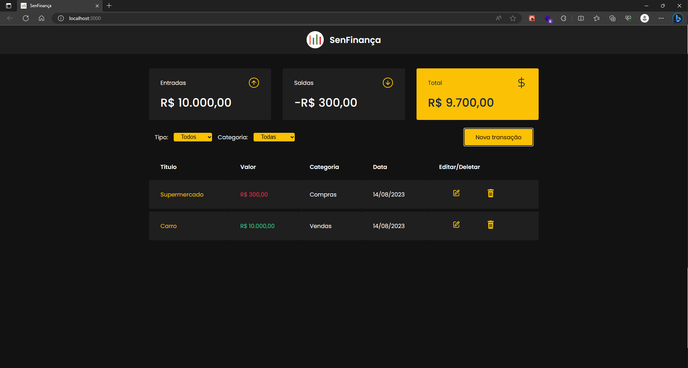
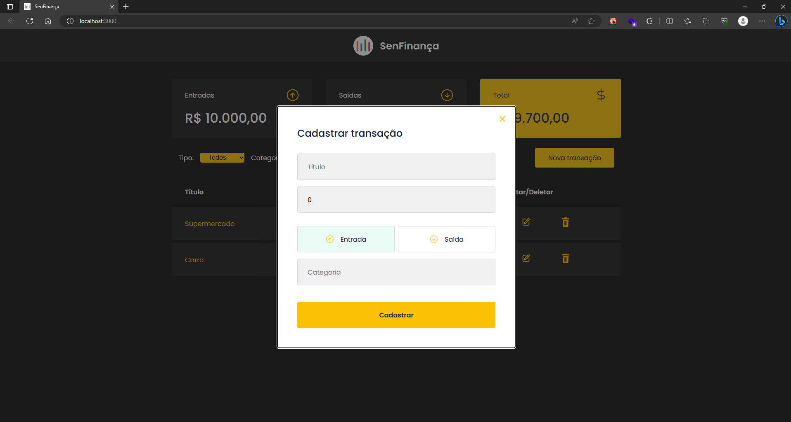

<h1 align="center">
  
  <strong>SenFinança</strong>
</h1>

<p align="center">
  <a href="#-projeto">Projeto</a>&nbsp;&nbsp;&nbsp;|&nbsp;&nbsp;&nbsp;
  <a href="#-prints">Prints do projeto</a>&nbsp;&nbsp;&nbsp;|&nbsp;&nbsp;&nbsp;
  <a href="#-tecnologias">Tecnologias</a>&nbsp;&nbsp;&nbsp;|&nbsp;&nbsp;&nbsp;
</p>

<br>

## 💻 Projeto

<p>O <strong>SenFinança</strong> é uma aplicação de controle financeiro, onde é possível cadastrar, editar e excluir transações e ver o saldo de entrada e saída 💰</p>

- Cards

  - Entradas

  - Saídas

  - Total

- Filtros:

  - Tipo (filtra as transações através do tipo)

  - Categoria (filtra as transações através da categoria)

- Modal (Para cadastro de transação, quanto para edição de uma transação em específico)

- Tabela

  - Título

  - Valor

  - Categoria

  - Data

  - Editar/Deletar

## 📷 Prints do projeto

### **Dashboard**


  
### **Modal**


## 🚀 Tecnologias

Esse projeto foi desenvolvido com as seguintes tecnologias:

- ReactJS
- TypeScript
- Styled-Components
- MirageJS
- Axios

## ⚙️ Rodando o projeto localmente

Para começar a trabalhar você precisará executar alguns comandos, levando em consideração te já instalado em seu computador o [Git](https://git-scm.com/) e o [NodeJS LTS](https://nodejs.org/en/), depois é só seguir os seguintes passos:

1. Clone para seu computador

2. Na raiz do repositório, instale as dependências necessárias

   ```bash
   npm install

   # or

   yarn install
   ```

3. Rode o projeto

   ```bash
   npm start

   # or

   yarn start
   ```
